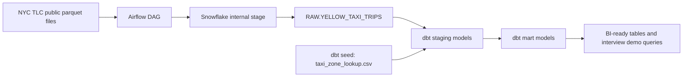

# NYC Taxi Snowflake Data Warehouse

An end-to-end analytics engineering project that builds a layered warehouse for NYC yellow taxi trips using Snowflake, dbt, and Airflow.

The project answers practical business questions:

- Which pickup zones generate the most revenue and demand?
- How does demand change by hour, weekday, borough, and airport corridor?
- Which zones show unusually high tips, long trips, or late-night demand?
- What data quality checks should protect downstream dashboards?

## Stack

- **Snowflake**: cloud warehouse, raw landing tables, internal stages
- **dbt**: staging and mart transformations, tests, documentation
- **Airflow**: orchestration for ingestion, loading, dbt run, and dbt test
- **NYC TLC public data**: yellow taxi trip records and taxi zone lookup

## Architecture



## Warehouse Layers

- `RAW`: immutable ingested records stored as Snowflake `VARIANT`
- `STAGING`: cleaned, typed, lightly standardized dbt views
- `MARTS`: analytics-ready facts, dimensions, and aggregate tables

## Project Structure

```text
nyc-taxi-snowflake-warehouse/
  airflow/dags/nyc_taxi_warehouse_dag.py
  dbt/models/staging/
  dbt/models/marts/
  dbt/seeds/taxi_zone_lookup.csv
  docs/architecture.mmd
  snowflake/setup.sql
  docker-compose.yml
```

## Quick Start

1. Create a Snowflake trial or use an existing Snowflake account.
2. Run `snowflake/setup.sql` in a Snowflake worksheet.
3. Copy `.env.example` to `.env` and fill in your Snowflake credentials.
4. Start Airflow:

```bash
docker build -t nyc-taxi-airflow:2.9.3 .
docker compose up airflow-init
docker compose up
```

5. Open Airflow at `http://localhost:8080`.
6. Trigger `nyc_taxi_warehouse`.

Default Airflow credentials are `airflow` / `airflow`.

## What The DAG Does

1. Creates Snowflake stage and raw table if missing.
2. Downloads NYC TLC yellow taxi parquet files.
3. Uploads files to a Snowflake internal stage.
4. Runs `COPY INTO` to load raw records.
5. Runs `dbt deps`, `dbt seed`, `dbt run`, and `dbt test`.

## dbt Models

### Staging

- `stg_yellow_taxi_trips`: typed, filtered trip records
- `stg_taxi_zones`: cleaned taxi zone lookup seed

### Marts

- `dim_zones`: zone dimension with airport flag
- `fct_taxi_trips`: trip-level fact table
- `mart_daily_revenue`: daily revenue and operational KPIs
- `agg_hourly_zone_demand`: hourly pickup-zone demand table

## Example Interview Talking Points

- Designed a raw-to-mart Snowflake warehouse using ELT patterns.
- Stored raw parquet rows as `VARIANT` to preserve source fidelity.
- Used dbt tests for uniqueness, accepted values, relationships, and metric sanity checks.
- Built Airflow orchestration with idempotent Snowflake setup and repeatable dbt runs.
- Created BI-ready marts for demand, revenue, airport trips, tipping behavior, and utilization analysis.

## Suggested Extensions

- Add Great Expectations checks before Snowflake load.
- Build a Streamlit dashboard on top of the mart tables.
- Add incremental dbt models and Snowflake tasks for production-style optimization.
- Add CI with `dbt build` against a dev schema.
